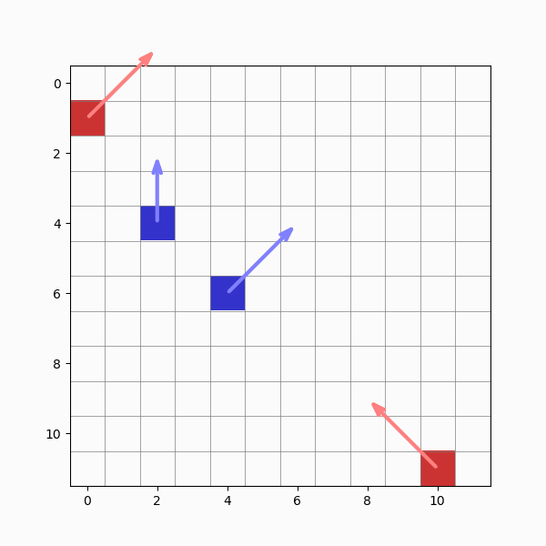

# MLDS Club Competitive Game of Life (2023 & 2024)

_Originally run as the semester‑long “Long Competition” in 2023 and 2024, co‑designed by Roberto Dailey & Henry Castillo._

---

## 📋 Repo Contents

- **MLDS Long Competition Rules 2023_2024.pptx**  
  Full slide deck with challenge overview, rules, maps, timeline, and submission details.

- **MLDS_2023_2024_comp_public_v1_02.ipynb**  
  Colab notebook containing all environment code, example agents, visualization tools, and instructions.

- **README.md** _(this file)_

---

## 🚀 Quickstart

### 1. Review the rules  
Open `MLDS Long Competition Rules 2023_2024.pptx` in PowerPoint, Keynote, or Google Slides to see:  
- Challenge description (“Competitive Game of Life”)  
- Map specs (5×5→50×50, wrap‑around, evolving walls)  
- Function signatures (enum vs. one‑hot input/output)  
- Tournament format, timeline, and submission instructions

### 2. Launch the notebook

- **Via GitHub → Colab**  
  Click the badge in the first cell of  
  `MLDS_2023_2024_comp_public_v1_02.ipynb`:

  [](https://github.com/your-org/MLDSClub_Competition_GameOfLife_2023_24/blob/main/MLDS_2023_2024_comp_public_v1_02.ipynb)

- **Original Colab link**  
  https://colab.research.google.com/drive/1l9k4F9vezXvMWutXu7rKy00mwv75NZxg?usp=sharing

_No local install required—everything runs in the cloud._

### 3. Run locally (optional)

```bash
git clone https://github.com/your-org/MLDSClub_Competition_GameOfLife_2023_24.git
cd MLDSClub_Competition_GameOfLife_2023_24
pip install numpy scipy matplotlib notebook
jupyter notebook MLDS_2023_2024_comp_public_v1_02.ipynb
```
### 🎮 Demo

> Animation of a sample match (random vs. random):



---

### 🎓 For Educators

Although the 2023–2024 competitions have concluded, this code is fully open for classroom use in machine learning, automata theory, or reinforcement‑learning courses. Feel free to adapt it for assignments or projects—and please let us know how it goes! You can open an issue here or email us at mlds.utexas@gmail.com.

---

### 🏆 Credits

- **Competition design & notebook**: Roberto Dailey & Henry Castillo  
- **Repository setup & organization**: MLDS Club GitHub team  
